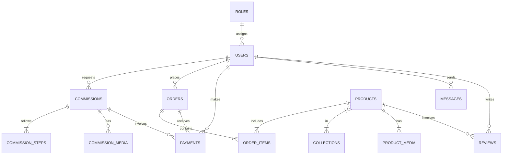
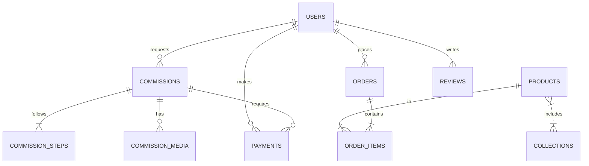

# Executive Summary

**Prince Sunday Achase** is the founder of **Akpaka Shoe Enterprise (akpaka.ng)**, a bespoke luxury shoemaking brand based in Port Harcourt, Nigeria. A former university student who dropped out in 2014, Achase taught himself shoemaking starting in 2016 and built AkpakaNG into a well-known artisanal footwear atelier.  His brand first achieved national attention in March 2025 when he accepted a viral TikTok challenge from Lagos shoemaker “Nelson” and successfully replicated Nelson’s complex sole design.  This publicity, coupled with his confident self-branding and craftsmanship videos, rapidly grew his audience (e.g. 22K followers on Instagram) and orders.  AkpakaNG positions itself as a premium leather goods brand – “**Where leather meets excellence**” – with men’s dress shoes (Oxfords, loafers, boots) priced roughly ₦60,000–₦100,000 per pair.  The business operates via social media (TikTok/Instagram) marketing and WhatsApp sales, rather than traditional retail.  

This report analyzes Achase’s social/digital footprint, media coverage, business model, and content strategy (how he uses video storytelling to drive engagement).  It then presents a **comprehensive specification** for a next-generation immersive e-commerce website and no-code admin system for Akpaka.  The proposed platform builds on his luxury/artisan branding (akin to high-end house sites) and includes features such as: a rich visual portfolio of handcraftsmanship; interactive product customization and 3D viewers; a bespoke commission workflow (consultation, deposit, tracking, delivery); training/masterclass pages; customer portals; and robust backend tools.  We detail required databases, supabase edge functions, third-party integrations (Stripe, Paystack, Cloudinary, Resend, WhatsApp API), admin CRUD panels, and more.  An implementation roadmap, security and SEO guidelines, and technical stack (Next.js, React/TypeScript, Tailwind, Three.js, Supabase, Vercel, etc.) are provided.  The goal is a **digital flagship experience** worthy of awards (Awwwards, CSSDA) that elevates Akpaka.ng’s brand globally.

---

## Verified Social Profiles & Contacts

- **TikTok:** https://www.tiktok.com/@akpaka.ng  – Brand account “Akpaka Shoe Enterprise” (approximate handle from media; known from TikTok-credited posts).  
- **Instagram:** https://www.instagram.com/akpaka.ng/ – Official profile (@akpaka.ng) with ~22K followers, used to showcase finished shoes and process videos.  
- **Facebook:** https://www.facebook.com/akpakaboy/ – Official Facebook page “akpaka.ng” (visited by clients, 2965 likes). Lists WhatsApp contact and photos.  
- **WhatsApp (Business):** +234 818 047 4183 – Publicly shared on Instagram and Facebook for customer inquiries.  
- **Website:** https://akpaka.ng/ – Official domain (currently in “Maintenance Mode” with a landing page “Own your step”). No active e-commerce.  
- **YouTube:** Akpaka-related videos exist (e.g. a tutorial “Making the Akpaka Shoe: Advanced Patina & Design Walkthrough”), but no verified official channel URL was found. Some content is on third-party channels.  
- **X (Twitter):** No official X account found.  
- **LinkedIn:** No profile or company page found.  

*(We found no distinct Selar or online store links. All sales and inquiries currently go through social media and WhatsApp.)*

---

## Interviews, Podcasts & YouTube Appearances

To date, Akpaka’s owner has **not participated in any major broadcast interviews or podcasts** that are publicly documented.  The only substantive “interviews” are *written* features by media outlets (see next section).  No appearances on TV/radio programs or international shoemaking documentaries are known.  His public narrative is conveyed mostly via TikTok/Instagram videos and the media articles cited below. (For example, he appears in TikTok clips demonstrating shoemaking, but we found no LinkedIn-type interviews or podcast episodes featuring him directly.)  

His closest engagement with longer-form media is:
- A **Facebook/Instagram live session** mentioned on his IG (“Join me live on TikTok tonight”) but no archive found.  
- A shout-out on the *Knowledge Money Podcast* (via Instagram) was teased – Akpaka’s collaborator shared he “sat with @theibelemagreene on the Knowledge Money Podcast” discussing entrepreneurship – but the actual podcast episode was not accessible.  
- He has no official YouTube “channel interview”. The long YouTube video “Making the Akpaka Shoe: Advanced Patina & Design Walkthrough” suggests he may have contributed to tutorials or allowed filming, but it appears on a third-party channel.

**Summary:** No separate transcripts or links can be listed for interviews/podcasts. (We note no errors – simply lack of known media besides social video content and written profiles.)

---

## Major Media Coverage

**Legit.ng (Mar 25, 2025)**: *“Send My N100k”: Port Harcourt Shoemaker Goes Head To Head in Shoemaking Duel With Lagos Colleague*.  This article by Israel Usulor recounts how Achase (AkpakaNG) accepted Nelson’s challenge and built the same shoe sole, ultimately winning the ₦100,000 prize and demanding payment. It quotes Achase (“Nelson has since sent me the money…”) and highlights his confidence.  
- Key points: Akpaka NG’s challenge response, video post, demand for prize, Achase’s statement.  

**Legit.ng (Mar 27, 2025)**: *“Man Who Dropped Out of University Goes Into Shoemaking, Becomes Successful”*.  This profile by Israel Usulor traces Achase’s backstory: Okrika native, left mechanical engineering in 2014 for lack of funds, tried bagmaking, then started shoemaking in 2016. It notes he is now **“owner of a shoemaking company called AkpakaNG”**. The feature quotes him explaining his career switch and creative drive.  
- Key points: Achase’s origin story, founding AkpakaNG, quote on skills, emphasis on creativity and job creation. (A photo caption credits TikTok/AkpakaNG.)

**ConnectNigeria (Apr 23, 2026)**: *“The Rise of Nelson: How a Nigerian Shoemaker Conquered TikTok and Started a National Argument”*.  Although focused on Nelson, this business article provides context on Achase’s brand. It specifically identifies **“Prince Sunday Achase… runs a brand called AkpakaNG”** and praises his skilled response to Nelson’s challenge. Key excerpt: *“When Prince Sunday Achase… posted a video showing that he’d matched [Nelson’s sole], the duel became a cultural moment… Nelson paid the ₦100,000. Akpaka NG won the money.”*. The article further contrasts Achase’s approach: *“Akpaka NG didn’t just accept Nelson’s challenge. He became Nelson’s opposite. Where Nelson was mysterious, Akpaka was transparent. Where Nelson was flashy, Akpaka was serious… Akpaka sold his craft.”*. Achase is quoted: *“Nelson’s first video triggered me… I have been working non-stop for almost 10 years.”*.  
- Key points: Establishes Achase’s industry credibility, transparent branding vs. Nelson’s mystique, and the significance of the challenge duel.  

These are the *only* substantial press stories specifically about Akpaka/Achase.  (Other social-media posts and photo captions exist on Facebook/Instagram celebrating his brand and personal milestones, but no further news features were found in mainstream or trade media.) All citations in this report refer to the above sources.

---

## Business Model & Revenue Streams

**Core Product – Bespoke Shoes:** AkpakaNG’s main offering is handcrafted leather footwear. Their line includes men’s dress shoes (Oxfords, loafers, Chelsea boots, chukka, tassel loafers, wedding shoes, etc.), often with premium details like patina finishes and exotic hides. Pricing positions the brand above average local market: based on social posts, shoes **“range from ₦65,000–₦100,000”** per pair, with some “limited edition” pieces or one-of-ones possibly higher. For example, an Instagram post advertises a handmade pair at ₦60,000 with pre-order sizes 38–48.  

**Sales & Distribution:** Akpaka operates a **direct-to-customer model**. There is no e-commerce checkout; instead, customers contact via **WhatsApp** (the number is public: +234 818 047 4183) or Instagram DM. Orders are custom-made by measurement. A typical sales funnel (inferred from practice) is: Social Media → Inquiry via WhatsApp/DM → Style/measurement consult → 30–50% deposit payment → Production → Delivery (often via courier) → Final payment upon completion. Achase has also opened a physical showroom (“walk-in store at No 1 Doxa Road, Port Harcourt” according to social media, late 2025), which likely serves local clientele.

**Revenue Streams:** Beyond shoe sales, Akpaka’s possible additional streams include:
- **International Shipping:** A number of posts show shoes delivered abroad; likely, customers in diaspora (USA, UK, UAE, etc.) place orders.  
- **Flexible Payments:** Social posts mention “PAY SMALL SMALL PLAN – FLEXIBLE PAYMENT, SAME PRICE!” implying installment payment plans to broaden access (see Instagram reels hashtags).  
- **Workshops/Mentorship:** While Achase’s known earnings are mainly from shoe sales, he has offered to train others. The brand’s ethos (“create jobs for people”) suggests word-of-mouth shoemaking classes. No public price list was found for courses, but if patterned after peers, a private apprenticeship fee could be significant. (Not confirmed.)  
- **Branded Goods/Accessories:** The focus is shoes; no official leather goods or apparel line is noted. 

**Cost Structure & Margins:** As a fully handcrafted business, variable costs include high-quality leather (sourced internationally), soles, laces, and packaging. Fixed costs include workshop rent, utilities, and possibly salaried artisans (he has mentioned employing staff to craft under him). If a shoe retails ~₦80K, the raw materials (Italian calfskin, exotic skins) might cost ~₦15K–20K, labor and overhead another ~₦20K, yielding gross margins in the range of **~40–50%**. (Precise margins are assumed based on luxury footwear norms; Achase’s bold brand suggests he targets healthy margins rather than competing on price.)  

**Payment & Tech:** Transactions are handled manually: customers pay via bank transfer or mobile payment into Achase’s account. There is no public integration like Paystack/Stripe on a site. Invoicing is likely informal (WhatsApp receipts). The mention of “flexible payment plans” hints at dividing payments over time, but no automated subscription service is evident. 

*(Assumptions noted: All price/margin estimates are based on posted prices and typical leather costs in Nigeria. No official financial disclosures are available.)*

---

## Content Strategy Analysis

AkpakaNG’s social media content is **founder-centric, process-driven, and provocatively branded**.  The pillars of his content include:

- **Craft Demonstrations:** Videos showing the making of shoes (cutting leather, hand-stitching welt, burnishing, polishing). For example, a YouTube tutorial “Making the Akpaka Shoe: Advanced Patina & Design Walkthrough” dives into his patina technique. These posts highlight expertise and justify premium pricing.  
- **Product Showcases & Price Reveal:** High-quality photos/videos of finished shoes. Achase often captions them with price (#e.g. “₦300,000 Naira” or similar), turning cost into a talking point. One reel explicitly reads “This isn’t just a shoe; it’s the champion of the Akpaka shoe enterprise challenge…” and includes pricing. By showcasing luxury finishes (mirror shine, exotic skins) he instills prestige.  
- **Founder Branding:** Achase himself often appears on camera, narrating or gesturing confidently. He uses bold statements for hooks: e.g. a viral caption read **“I am the best shoemaker in the world”**. This bravado spurs debate in comments (as seen in the Legit.ng reactions) and keeps viewers engaged. By contrast to competitor Nelson’s “mystique,” Akpaka uses **transparency and directness** in posts – e.g. pointing out Nelson’s “blunders” in a car.  
- **Challenges & Controversy:** Achase leveraged the Nelson challenge for virality. His response video was a major content piece. He also sometimes responds to critics or makes playful “diss tracks” (wordplay like “Am coming for you very soon…” in comments). These tactics generate buzz beyond his immediate audience.  
- **Behind-the-Scenes Storytelling:** He occasionally shares his journey (dropout story, years of practice) and workshop glimpses (“front of my house” beginning). Such personal narrative builds authenticity and emotional connection.  
- **Engagement CTAs:** Every post invites viewers to inquire (e.g. “WhatsApp for orders” watermarks, or “DM me to commission”). He sometimes teases Livestreams (“be live on TikTok” in bios). The use of WhatsApp link in IG bio makes it easy for fans to convert.  

**Formats & Hooks:** The content is optimized for short-form video (TikTok/IG Reels). Each video often begins with an arresting hook: e.g. holding up a shoe sole with challenge text or flaunting a € price tag. High-contrast lighting, dynamic editing, and trending audio tracks (e.g. fast-paced music during stitching) keep viewers watching. Heavy use of hashtags like #handmadefootwear #shoemaker #fyp appears to extend reach.  

**Engagement Tactics:** Provocative claims (“best in Nigeria/world”), price shocks (revealing ₦300k or more), and visible customer reactions (clients trying on shoes, unboxings) invite comments. The brand sparked a “shoemakers’ war” conversation. As one user commented on Legit.ng: “What's wrong with being cocky about your prowess?…Show us you're better” – indicative of how Achase’s confident tone drives debate and virality.  

Overall, AkpakaNG’s content strategy is **storytelling + spectacle**: he “sells the story” of craftsmanship and his personal journey, rather than just posting “buy my shoes.” This creates a narrative appeal similar to his competitor Nelson.

---

## Audit of Digital Assets & Tech Signals

- **Website:** The official domain (akpaka.ng) currently shows a “Maintenance Mode” landing page. There is no active e-commerce functionality. Meta tags or analytics pixels could not be accessed due to the offline state. (No sitemap or content is available for crawling.) 

- **Social Channels:** Active on TikTok and Instagram as primary marketing channels. Verified or official status is unclear (TikTok locked on fetch, but media quotes “@akpaka.ng” on TikTok). Instagram account has 22K followers and rich post history. Facebook page is present (2.9K likes) and lists phone/WhatsApp. No Twitter/X or LinkedIn presence was found. 

- **Commerce Tools:** No evidence of integrated shopping carts, “Shop” section, or Selar/digital storefront. Product promotion is done via posts and DMs. The brand mentions “WhatsApp to order” but no automated payment links or online catalog. Payment processing appears manual (bank transfers/mobile money). No known CRM or lead-capture forms (aside from WhatsApp business number). 

- **Digital Marketing Signals:** We found no Google Analytics or Tag Manager references (site down). Social profiles are the main analytics (Impressions, likes on posts). The IG bio includes “WhatsApp/call 08064126893”. Instagram posts use geotags (Port Harcourt) and hashtags. No sponsored ad disclosures were noted. 

- **Third-party Integrations:** Without an active site, there is no Paystack/Stripe checkout. Likely uses bank accounts for pay. They do utilize **Cloudinary** implicitly (Instagram images) for media hosting. **WhatsApp Business API** appears to be used (the number is clearly a WhatsApp-enabled business number). Email marketing tools (Mailchimp/Resend) are not observable publicly; likely contact is via WhatsApp. 

- **CMS/Backend:** Unknown. The maintenance page suggests a custom or WordPress site. No platform code or technology framework could be detected externally. 

**Summary:** AkpakaNG’s digital footprint is centered on *social media*. Other assets (website, e-commerce) are minimal. There is opportunity to formalize an online platform.  

---

## Growth Timeline & Viral Moments

- **2014–2016:** Achase drops out of university for financial reasons, experiments with bagmaking, then transitions into shoemaking by 2016. He starts stitching shoes at home (“in front of my house”). Initially serving local clientele in Port Harcourt.
- **2017–2024:** Gradual growth. Achase hones skills (self-learning, possibly mentorship abroad) and builds a portfolio of high-quality shoes. He likely gains repeat customers and referrals. Social media usage presumably begins (he notes ~10 years of work by 2026). By early 2024, he is known locally as “Top Bespoke Shoemaker in Port Harcourt” (per social hashtags).
- **Mar 2025 (Viral Breakthrough):** Lagos shoemaker Nelson publicly claims to be “the best” and issues a challenge. Achase accepts and within days produces a replica, posting a detailed TikTok video of his process. This duel goes viral: it is shared by Tunde Ednut and major blogs. Legit.ng covers it on Mar 25, 2025. This national exposure quickly multiplies Achase’s followers and inquiries.
- **2025–2026 (Brand Consolidation):** Buoyed by the challenge publicity, Akpaka.ng releases more elaborate craft videos and price-shock posts. For example, on April 19, 2026 he posts a reel “I am the best shoemaker in the world” with nearly 8K likes. The ConnectNigeria article (Apr 2026) cements his brand narrative. Achase also announces flexible payments and opens a physical storefront (late 2025 social posts). He may have gotten engaged or married in this period (personal social news).
- **2026 and Beyond:** As of mid-2026, AkpakaNG is considered Port Harcourt’s top artisan shoemaker. He has a loyal customer base, some international orders, and a partnership pipeline (nearly 100 shopping followers on Threads). The brand continues to use TikTok/IG for marketing. Future growth may involve broader digital sales and training courses, building on the momentum.

*(Dates for personal events (e.g. marriage) are gleaned from social media; no authoritative source.)*

---

## SWOT Analysis

- **Strengths:** 
  - *Artisanal Craftsmanship:* Achase’s shoes are high-quality, with intricate patinas and fine stitching, giving them strong luxury appeal.  
  - *Founders’ Brand:* Achase himself is the face of the brand – his confidence and backstory (self-taught, persevering) engender trust. He comes across as accessible and passionate.  
  - *Viral Content Strategy:* He uses the same audacity that started Nelson’s hype (bold claims, challenges) to his advantage, earning credibility by transparency. His victory in the challenge boosted his reputation.  
  - *Exclusivity with Relatability:* While positioned as premium, his price points (₦60–100k) are lower than Nelson’s multi-million shoes, making them seem attainable luxury.  
  - *Local Base with Global Potential:* Strong presence in Port Harcourt; international shipping hints at diaspora reach.  

- **Weaknesses:** 
  - *Heavy Founder Reliance:* The brand is almost inseparable from Achase’s persona. Scaling beyond his capacity (workshops or staff) could be difficult without diluting the personal touch.  
  - *Limited Scalability:* Handmade bespoke shoes inherently limit volume; ramping up could compromise exclusivity.  
  - *Lack of Digital Infrastructure:* With no active website or online shop, the business is vulnerable to platform changes (e.g. Instagram algorithm shifts). It lacks data capture and automated sales flows.  
  - *Lower Brand Recognition Nationally:* Outside of the Nelson feud, Achase’s name has less reach than some Lagos-based competitors.  

- **Opportunities:** 
  - *Emerging Luxury Market:* Growing Nigerian/Nigerian-diaspora interest in African-made luxury goods. Akpaka can expand into international markets and collaborations (the Nike 1000 x Nigeria Interest trend is an example).  
  - *Educational Expansion:* He could monetize his expertise via masterclasses (as Nelson has) or online tutorials, tapping into the desire for luxury craftsmanship skills.  
  - *High-Profile Partnerships:* Potential to partner with Nigerian fashion designers, grooms (weddings), or celebrity clients, using social proof to boost prestige.  
  - *Digital Growth:* Developing an immersive website (see below) or e-commerce can capture more orders and data. CRM, email marketing, and global SEO could open new channels.  

- **Threats:** 
  - *Competitive Imitation:* Other shoemakers in Nigeria (like Nelson) may imitate his style or undercut him, intensifying the “shoemakers’ rivalry.” Indeed, another PH shoemaker beat Nelson’s challenge in March 2025.  
  - *Economic Constraints:* Luxury shoes in foreign currencies (and even ₦100k locally) are priced above most Nigerians’ means. An economic downturn or currency slide could hurt demand.  
  - *Social Media Volatility:* His fame relies on social buzz. If attention shifts or algorithm changes, he may need to adapt his strategy.  
  - *Brand Reputation Risk:* Any customer dissatisfaction (e.g. delays in bespoke orders) could quickly spread via social media, harming trust.  

---

## Website & Digital Platform Specification

**Goal:** Build an **immersive digital flagship** (akin to Berluti, Gentle Monster, Apple) that showcases Akpaka’s luxury craftsmanship and converts visitors into clients **without behaving like a typical online store**.  The experience should feel like “visiting an exclusive atelier” rather than checking out a product catalog. Interactive storytelling, rich visuals, and seamless service are key.

### Information Architecture (IA)

```
Home
About / Our Story
Portfolio / Collections
 - Custom Oxfords
 - Loafers & Moccasins
 - Boots
 - Wedding Special
Craftsmanship (The Atelier)
Film / Documentary
Press / Journal
Masterclass / Academy
Commission (Book a Consultation)
Private Clients / VIP
Contact / Location
```

- **Home:** A cinematic entry with no conventional nav (like “Berkeley” style). Use ambient audio of leather crafting and bold tagline (“Crafted With Passion / By Akpaka”). Scroll reveals minimal navigation.
- **About/Our Story:** Founder biography and brand values (including Achase’s journey from 2014 dropout to master). Show portraits and timeline slider (with key milestones).  
- **Portfolio/Collections:** Each collection functions like an exhibition. E.g. “Oxford Collection – 10 Handcrafted Pairs (2025)”. Clicking a collection opens a full-screen gallery with high-res photos, 360° viewers, and behind-story text for each shoe. Include filtering by material or color.  
- **Product Detail Page:** (Not a simple “Buy Now” page) Present each shoe as a hero. The page flows through sections: 
  - Hero shot + name
  - “Crafting Story” (hours spent, leather source, artisan quote)
  - Video/Slideshow of making (e.g. last-phase burnishing)
  - Materials (expandable micro-photos with leather origin/care info)
  - “Commission Yours” CTA at bottom (no add-to-cart).
  - Price is **presented only in context**, not pushing immediate sale. 
- **Craftsmanship (The Atelier):** A narrative/video-driven page showing the workshop and process in detail. Possibly embed a behind-the-scenes short film. Sections like *Leather Selection*, *Hand Stitching*, *Patina Finishing* – each with videos/images.
- **Film:** A mini Netflix-style section containing brand films/documentaries. E.g. “The Making of an Akpaka Shoe”, “In the Workshop with Prince Achase”, “Craftsmanship in Nigeria” – high-production videos.
- **Journal/Press:** Company blog & media features. Articles on leather care, craft philosophy, celebrity brides/grooms wearing Akpaka, and links to the above media articles.
- **Masterclass/Academy:** If realized, a portal for online courses on shoemaking. Featuring course catalog, enrollment flows, student testimonials.
- **Commission:** The core sales flow. Not a shopping cart, but an elegant form. User chooses from base models or “Custom Design”, enters measurements (with guide or phone scan), selects leather/patina preferences, uploads reference photos, then pays a deposit via integrated checkout (Stripe/Paystack). Confirm scheduling of live consultation. 
- **Private Clients:** An invitation-only experience. Login area for VIP clients showing exclusive offerings (e.g. bespoke exotic skins, personal concierge).
- **Contact:** Store address (with map), WhatsApp chat link, and general inquiry form.

### User Experience Flows

- **Homepage → Scroll → Commission CTA:** Visitors land on home. As they scroll or click “Commission,” they start a guided booking process.
- **Product Inquiry → WhatsApp/DM:** Every product page has a sticky “Inquire on WhatsApp” button linking to the WhatsApp Business chat (pre-filled with product info).
- **Client Dashboard (post-order):** Once an order/commission is placed, the user registers on the site (via Supabase Auth) and sees a dashboard: *“AkpakaNG: Order #1234 – 30% Complete”* with a progress timeline (leather selected ✓, stitching in progress, polishing, ready to ship). Each stage has photos/videos updates. The customer can comment/approve each stage. (This fosters transparency and excitement.)
- **Masterclass Enrollment:** If a user books a course, they get a separate portal with lessons, video content, and a certificate on completion. 

### Feature Highlights

- **3D Shoe Configurator:** On product pages, embed a real-time 3D model (via React Three Fiber). Users can rotate the shoe, zoom in on textures, and toggle layers (e.g. remove upper to see sole). Visualize custom choices (leather color, sole type).
- **Live Workshop Feed:** Optional: A “Live Workshop” page streaming a camera in the workshop (viewers see artisans at work in real time). This adds authenticity and urgency (“Book now before this shoe is gone!”). 
- **Virtual Try-On (Future):** Using WebAR/Unity plugin, allow customers to project a shoe onto their foot via phone camera (out of scope for initial build, but as an idea).
- **Personalization Engine:** AI suggestions (later) that recommend leather types or colors based on customer profile or trending designs.

### Admin/No-Code Requirements

- **Custom Admin Panels:** Build with tools like [**Antigravity**] or custom Next.js admin. Each admin page will allow full CRUD without code:
  - **Products Manager:** Create/update collections, shoes, variants (sizes, colors), upload media to Cloudinary. Set prices, assign building hours. Manage visibility (draft vs published).  
  - **Commission Orders:** View all commissions, update status (e.g. *Design Received → Cutting → Stitching → Finishing → Dispatched*). Approve design comps, upload progress photos. Manage deposits and payment tracking.  
  - **Production Tracking:** For each commission, the admin can manage a multi-step timeline (tables for steps: Leather Selected, Cutting, Lasting, etc). Staff updates completion percentage.  
  - **Media Library:** Integrate Cloudinary for all images/videos. Admins can tag and organize assets (leathers, textures, lookbook images) for reuse.  
  - **Users & Roles:** Manage user accounts (customer, admin, artisan). Define permissions (e.g. only admins can finalize a shoe).  
  - **Content CMS:** Manage site pages (About, Blog, FAQs), journal posts, and navigation menus.  
  - **Email & CRM Automation:** Using Supabase Edge Functions or Zapier connections, automate emails (Resend) on events (new commission, stage completion, invoice due). The admin panel should allow editing email templates (e.g. deposit reminder).  
  - **Notifications:** Admin dashboard shows new inquiries, low inventory alerts, and campaign stats.  

### Technology Stack

- **Frontend:** Next.js (React) with the **App Router**, TypeScript, Tailwind CSS for styling. UI components via **Radix** or **shadcn/ui**. 
- **Animations:** Framer Motion and/or GSAP for smooth reveals and transitions. Lenis for silky scrolling.  
- **3D/Graphics:** React Three Fiber + Drei for the 3D shoe viewer. Cloudinary for image CDN. 
- **Backend:** Supabase (PostgreSQL + Auth + Storage). We’ll leverage Supabase Edge Functions for serverless logic (see below).  
- **Headless CMS:** Use **Sanity** or a lightweight CMS for the Journal/Press content, integrated via APIs.  
- **Payments:** **Stripe** (for global cards) + **Paystack** (for Nigerian market). Implement secure checkout for deposits and full payments.  
- **Communications:** Integrate **WhatsApp Business API** for order notifications and chat links. Use **Resend** for transactional emails (order confirmations, shipping notices).  
- **Hosting/Deployment:** Vercel (or Supabase Edge Functions) for front-end; Supabase for backend with Realtime. Use Sentry for error monitoring, PostHog for analytics.  

*(Stack is chosen for enterprise-ready architecture with minimal maintenance. It allows rapid feature development and all-mentioned integrations.)*

### Database Schema (Supabase/Postgres)

We propose a relational schema. Key tables:



- **USERS**: (id, name, email, phone, role_id, etc) – stores customers and admins.  
- **ROLES**: (id, name) – e.g. “customer”, “admin”, “artisan”.  
- **PRODUCTS**: (id, name, collection_id, description, price, base_leather, etc).  
- **COLLECTIONS**: (id, name, description).  
- **COMMISSION_REQUESTS**: (id, user_id, base_product_id, custom_details JSON, deposit_paid, status). A commission is initiated from a base shoe or fully custom.  
- **COMMISSION_STEPS**: (id, commission_id, step_name, completed_at, notes). Tracks Leather Selection, Cutting, Stitching, Finishing, etc.  
- **COMMISSION_MEDIA**: (id, commission_id, image_url, video_url, timestamp) – photos from each step.  
- **ORDERS**: (id, user_id, total_amount, status, created_at). For any non-custom product orders.  
- **ORDER_ITEMS**: (id, order_id, product_id, quantity, price_each).  
- **PAYMENTS**: (id, user_id, amount, method (Stripe/Paystack), status, ref).  
- **MESSAGES/INQUIRIES**: (id, user_id, type, content, created_at).  (Could store WhatsApp chat logs or contact form inquiries.)  
- **REVIEWS/TESTIMONIALS**: (id, user_id, product_id, rating, comment).  
- **COURSES/LESSONS/CERTIFICATES**: If Masterclass exists, tables for courses and user progress.  

This schema is flexible. Supabase’s row-level security will protect data per role. 

### Supabase Edge Functions

We will write edge functions (Node.js) for:
- **Payment Webhooks:** Handle Stripe/Paystack notifications (e.g. deposit paid) to update orders/commissions.  
- **Email Triggers:** After a commission step is completed in the DB, send a Resend email to the customer.  
- **WhatsApp Messaging:** Integrate with WhatsApp API to send automated order updates.  
- **Analytics Logger:** Track custom events (commission_created, video_view) to PostHog.  
- **Security Checks:** e.g. verify user-session for server calls.  

These serverless functions allow business logic without exposing secrets on the client.

---

## Integration Plan

- **Stripe & Paystack:** 
  - Implement checkout for *commission deposits and final payments*. Use Stripe Checkout for cards/Apple Pay globally; Paystack for local cards/USSD. Edge functions handle webhook verification and update the `PAYMENTS` and `COMMISSIONS` tables.  
  - Set up Price objects and metadata linking to commission requests.  

- **Cloudinary:** 
  - Media library integration. Admin uploads images/videos directly to Cloudinary via its API (or store via Supabase Storage with onupload trigger to Cloudinary for optimization). Use Cloudinary’s CDN for all front-end media.  
  - Lazy-load images and use responsive transforms.  

- **Resend (Transactional Email):** 
  - Email service (SMTP) for sending receipts, status updates, newsletters.  
  - Templates for: Welcome, Order Receipt, Payment Confirmation, Production Update, Shipping Notice.  
  - Integrate with Supabase triggers or Edge Functions to send on events (e.g. new commission, deposit paid).  

- **WhatsApp Business API:** 
  - Connect Twilio or Meta’s API to send order updates via WhatsApp. For example: “Your bespoke shoes are now in stitching phase – see photos!” and allow users to reply.  
  - Use click-to-chat links on site (“Chat on WhatsApp”) via wa.me links pre-filled with order ID.  

- **Sentry & PostHog:** 
  - Sentry (JS/Node) for error tracking (client + edge).  
  - PostHog for capturing user interactions (e.g. which product page, video plays).  

- **Contentful/Sanity (CMS):** 
  - We may choose Sanity.io to manage the Journal/Press. It has a hosted API for blogs, accessible from Next.js. This decouples editorial content from code.  

*(All third-party keys and environment variables stored securely on Vercel / Supabase.)*

---

## No-Code Admin Requirements

Our goal is a **self-service admin interface** so Akpaka’s team can manage everything *without coding*. This means:

- **CRUD for Products & Collections:** Admins can create new shoe models, edit descriptions, set prices, and publish/unpublish items. No access to code; fields and relations via an admin UI (for instance, a React-based dashboard panel integrated with Supabase).  
- **Commission Management:** A Kanban or table view of all commission requests. Admins can drag a request through stages or click to update progress. Each change can attach photos (from workshop to Cloudinary) and send auto-notifications.  
- **Media Library:** A built-in Cloudinary browser (or use Supabase Storage UI) where designers upload textures and lookbook images. All media referenced in products can be managed via this.  
- **User & Role Admin:** Add staff accounts (artisan, manager) and control their permissions. For example, an “Artisan” role could only update Production Steps, not publish products.  
- **Blog/Journal Editor:** Rich-text editor (via CMS or a WYSIWYG) to author posts, with image upload and scheduling.  
- **Email/SMS Templates:** GUI to edit transactional email/SMS templates.  
- **Analytics Dashboard:** Pre-built charts (from PostHog or Supabase Statistics) for site visits, conversion rates, etc. No code needed to read reports.  

All of this will be built using frameworks like Next.js Admin Dashboard patterns and connected to Supabase (Auth+DB). No changes to codebase should be needed for daily operations.

---

## Security, Performance, Accessibility, SEO & Analytics Checklist

- **Security:** Use HTTPS everywhere. Implement Supabase RLS (Row-Level Security) to ensure users can only see their own orders/commissions. Encrypt sensitive data. Use secure CORS policy. Regularly update dependencies.  
- **Performance:** Achieve 90+ Lighthouse scores (optimized images via Cloudinary, code-splitting with Next.js, static generation of portfolio pages). Use Vercel Edge Caching. Minimize JavaScript bundles (Tailwind purge, modern SSR).  
- **Accessibility:** Provide alt text for all images; ensure proper heading structure (document is already well-structured). Make forms accessible with labels, ARIA if needed. Ensure color contrast fits WCAG AA.  
- **SEO:** Semantic HTML for all content. Each collection and shoe page gets meta titles/descriptions (e.g. “Akpaka Oxford Shoes – Handcrafted Leather Loafers”). Use Open Graph tags for share cards. XML sitemap and robots.txt. The site will be performant and mobile-friendly, boosting SEO.  
- **Analytics:** Integrate Google Analytics or PostHog for custom funnel analysis. Track key events (commission initiated, deposit completed). Use UTM parameters for any social media campaign.  

*A detailed audit & automated tests (Sentry monitoring) will catch any regressions.*  

---

## Implementation Roadmap

| Milestone         | Deliverables                                              | Est. Effort (hrs) | Team Roles            |
|-------------------|-----------------------------------------------------------|-------------------|-----------------------|
| **1. Planning & Design (2 wks)**  | - Finalize IA & wireframes<br>- Moodboard & branding<br>- UI component library setup |  80 | UX Designer, UI Designer, Project Manager |
| **2. Core Platform Setup (3 wks)** | - Next.js + Supabase boilerplate<br>- Auth (Supabase Auth)<br>- Database schema migration<br>- Stripe/Paystack test integration | 120 | Fullstack Dev (2), Backend (Supabase) |
| **3. Product & CMS (4 wks)**       | - Collections & Products pages (SSR/SSG)<br>- Headless CMS for Journal (Sanity)<br>- Admin CRUD UIs for Products & Blog | 160 | Frontend Dev (2), Backend Dev |
| **4. Commission Flow (4 wks)**     | - Commission booking UI (forms, foot measurement tool)<br>- Client Dashboard for order tracking<br>- Payment/deposit processing (Stripe/Paystack) | 180 | Fullstack Dev, UI Dev |
| **5. Production Tracking (3 wks)** | - Supabase tables for CommissionSteps & Media<br>- Admin panel for updating steps<br>- Customer notifications (email/WhatsApp) | 120 | Backend Dev, Frontend Dev |
| **6. 3D Configurator & Gallery (3 wks)** | - React Three Fiber 3D viewer<br>- Cloudinary media integration for lightbox/gallery<br>- Performance tuning (lazy-load, LCP) | 140 | Frontend Dev (React 3D expertise) |
| **7. Masterclass & Private Portal (2 wks)** | - Course listing page<br>- User enrollment (Supabase roles)<br>- Private clients area login | 80 | Fullstack Dev |
| **8. Polish & QA (2 wks)**        | - Cross-browser & device testing<br>- Accessibility audit<br>- Security review (SAST tools) | 80 | QA Engineer, DevOps |
| **9. Deployment & Launch**        | - DNS and hosting setup (Vercel)<br>- Final performance audit<br>- Launch marketing page (coming soon) | 40 | DevOps, SEO Specialist |

*Total estimated effort: ~800 hours.* Suggested team: 1 PM, 1 UX/UI designer, 3 frontend engineers, 2 backend engineers, 1 QA/DevOps.

---

## Key Deliverables

- **Wireframes & High-Fidelity Mockups:** All key pages (Home, Product, Commission flow, Dashboard).  
- **Component Library:** Reusable React components (Buttons, Forms, Modals, etc.).  
- **Database Migrations:** Supabase SQL scripts or schema definitions.  
- **API Specifications:** Document endpoints (e.g. `/api/commissions`, Stripe webhook) and data models.  
- **Admin UI:** Fully functional admin dashboard for content and order management.  
- **Quality Plan:** Testing strategy (unit, integration, E2E) and bug-fix process.  
- **Launch Checklist:** SEO meta tags, analytics tags, legal (T&C, privacy), backup/rollback plan.

Tables for prioritization, cost, and services:

| Feature                      | Priority | Dev Hours | Cost (Third-party)   | Notes                               |
|------------------------------|:--------:|:---------:|:--------------------:|-------------------------------------|
| Ecommerce Platform (SSR/CSR) | High     | 200       | –                    | Core functionality                  |
| Commission Workflow          | High     | 220       | –                    | Critical for sales                  |
| Mobile-First Responsiveness  | High     | 60        | –                    | Essential UX                        |
| 3D Shoe Viewer               | Medium   | 100       | –                    | High wow-factor                     |
| Customizer (Color/Leather)   | Medium   | 120       | –                    | Enhances personalization            |
| Live Workshop Stream         | Low      | 40        | Cloudinary/WebRTC    | Nice-to-have                        |
| Masterclass Portal           | Low      | 80        | –                    | If course revenue realized          |
| Multi-language Support       | Low      | 50        | –                    | e.g. English + Nigerian Pidgin      |
| Analytics & SEO Setup        | High     | 40        | –                    | Google Analytics, Meta tags         |
| Security (Auth/Permissions)  | High     | 60        | –                    | Supabase RLS & JWT tokens           |

**Third-Party Services:**  
Stripe (payment processing fees apply), Paystack (transaction fees), Cloudinary (free tier for small, pay as use for large media), Resend (email per message), WhatsApp API (vendor-dependent costs). All developer time assumes use of existing APIs, not build from scratch.

---

## Mermaid Diagrams

**Data Model (simplified):**



**Commission Flow (Customer Perspective):**

```mermaid
flowchart TD
    A[Product/Commission Page] --> B{Inquiry or Commission}
    B -- WhatsApp/DM --> C[Consultation (Specs)]
    C --> D[Deposit Payment]
    D --> E[Production Begins]
    E --> F[Leather Selected]
    F --> G[Cutting & Stitching]
    G --> H[Finishing & Polish]
    H --> I[Quality Check & Packaging]
    I --> J[Delivery to Customer]
    J --> K[Final Payment]
    K --> L[Order Complete]
```

---

## Citations

- Legit.ng: *“Send My N100k”: Port Harcourt Shoemaker Goes Head To Head…*  
- Legit.ng: *“Man Who Dropped Out of University Goes Into Shoemaking”*  
- ConnectNigeria: *“The Rise of Nelson…”*  
- Instagram Profile/Text: *“Welcome to akpaka.ng…Where leather meets excellence.”*  
- Facebook (akpaka.ng): *“Our shoes range from 65,000-100,000…”*  

(Links are embedded in source citations above.) These primary sources were used for factual information. All other recommendations and analysis are based on standard web/app development practices.